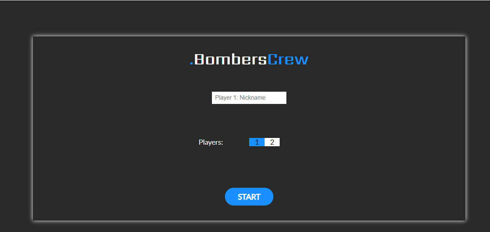
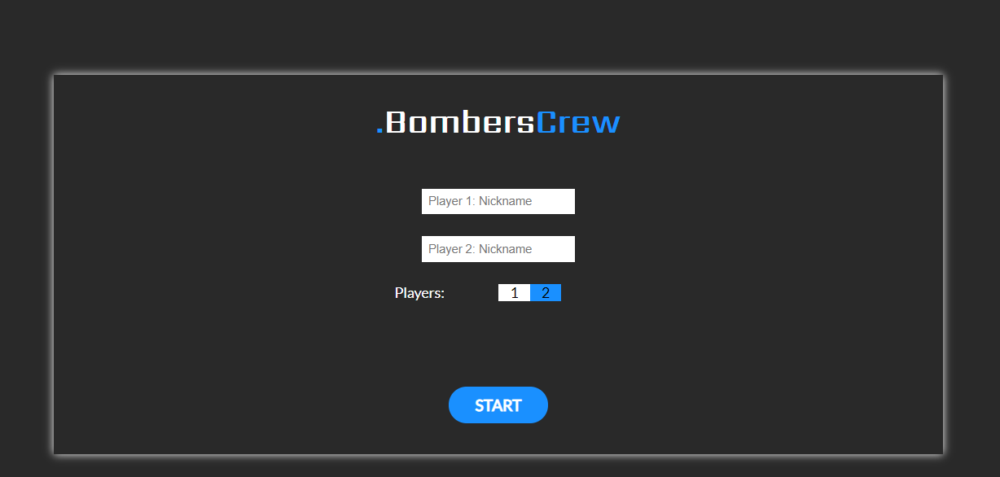
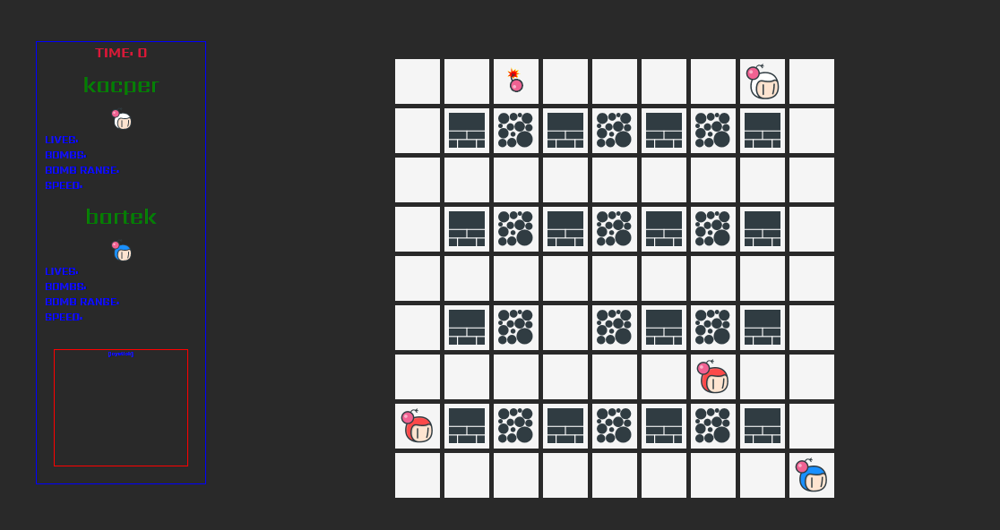

# Bomberman - CodersCamp TypeScript project

## Table of contents
* [General info](#general-info)
* [Technologies](#technologies)
* [Setup](#setup)
* [How to Play](#how-to-play)
* [Contributors](#contributors)
* [Link to Game](#link-to-game)


## General info
Bomberman is a strategic, maze-based video game franchise originally developed by Hudson Soft and currently owned by Konami. The first game in the series was released in Japan on December 20, 1985 (1987 in the US) and new games have been published at irregular intervals ever since.

## Technologies
For this project we used TypeScript, SCSS and HTML. 

## Setup
To run this project clone this project with `git clone` and install it locally using npm:

```
$ npm install
$ npm start
```

## How to Play
### First we need to choose number of players

One or Two Players




### Player1
* Arrows - Player movement
* Space - Bomb

### Player2
* W/A/S/D - Player movement
* E - Bomb

### Bots
In gameplay we have two bots whose walking on the map

### During gameplay we can put bombs


If you want win you need to kill all bots and the other player

## Contributors
* [Jakub](https://github.com/jkopyto)
* [Rafał](https://github.com/R4fau)
* [Jakub](https://github.com/kubaszajna)
* [Kacper](https://github.com/kacperzolkiewski)
* [Karolina](https://github.com/kgutka)
* [Adam](https://github.com/adam-kostuch)
* [Mateusz](https://github.com/mateuszCabala95)

## Link to Game
[Bomberman](https://mateuszcabala95.github.io/CodersCamp2020.Bomberman/)


